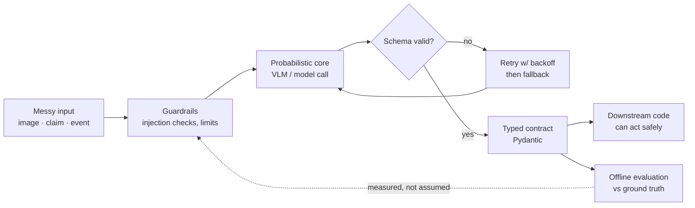

<div align="center">

<!-- ── HEADER ────────────────────────────────────────────── -->

# `JASWANTH SHARMA`

**Backend & Applied AI** · CSE Undergraduate · Vignan University

<br>

I build Python pipelines that turn **unstructured evidence** into **structured decisions**,<br>
and Node.js services that hold **real-time state** without falling over.

<br>

<a href="https://github.com/vu241fa04551-lgtm?tab=repositories">
  
</a>
<a href="https://www.linkedin.com/in/jaswanth-sharma-machiraju-a3295036b/">
  
</a>
<a href="mailto:vu.241fa04551@gmail.com">
  
</a>


</div>

---

> [!NOTE]
> **The one-line version:** I work on the seam where probabilistic output meets deterministic software — schemas, validation, retries, evaluation — so the rest of the system can trust what it's handed.

---

## `01` — ABOUT

Most of my work sits on the server side: the layer between a messy input — an image, a claim, a socket event — and a reliable, validated output.

Recently that has meant **vision-language models**: taking non-deterministic model output, constraining it into a schema strict enough for another system to act on, then building the evaluation harness to check whether it actually worked.

I'm drawn to the parts of a system that fail *quietly*:

```
retries · fallbacks · schema drift · validation · rate limits · partial failure
```

Making a model produce an answer is the easy half. Making the system around it trustworthy enough to *use* that answer is the interesting half.

---

## `02` — HOW I THINK ABOUT SYSTEMS



The loop on the right is the part most projects skip. It's the part I care about most.

---

## `03` — SELECTED WORK

### 🔬 Multi-Modal Damage Claim Verification

Decides whether submitted images **support**, **contradict**, or **fail to substantiate** a damage claim — combining image analysis, claim text, user history, and category-specific evidence requirements.

`Python` · `Vision-Language Models` · `Pydantic` · `pandas`

<details>
<summary><b>What it demonstrates</b> — click to expand</summary>

<br>

| Concern | How it's handled |
| :-- | :-- |
| **Output shape** | Model output constrained to a fixed taxonomy, Pydantic-validated |
| **Evidence weighting** | Image evidence deliberately outranks user-supplied history |
| **Multi-signal reasoning** | Several images reasoned over jointly, per claim |
| **Hostile input** | Prompt-injection guarding on user-written claim text |
| **Paid API discipline** | Exponential-backoff retries + rate limiting on external calls |
| **Correctness** | Separate offline evaluation against ground truth — zero extra API cost |

</details>

→ **[Multi-Modal-Evidence](https://github.com/vu241fa04551-lgtm/Multi-Modal-Evidence)**

---

### 👁️ WINK — Browser-Based Proctored Exam Platform

Candidates authenticate, sit timed exams under live face tracking, and receive performance results and certificates. No third-party proctoring service — the detection runs client-side.

`Node.js` · `Express` · `Sequelize` · `SQLite` · `MediaPipe` · `Chart.js`

<details>
<summary><b>What it demonstrates</b> — click to expand</summary>

<br>

- Client-side proctoring with MediaPipe FaceMesh
- Violation recording scoped per examination attempt
- Layered Express backend, Sequelize persistence over SQLite
- Performance dashboard: score, accuracy, and violation analytics via Chart.js
- Local-first architecture — no external proctoring dependency, no video leaving the browser

</details>

→ **[WINK](https://github.com/vu241fa04551-lgtm/wink)**

---

### 💬 Real-Time Chat API

A messaging backend built around Socket.IO: JWT auth, encrypted message bodies, media uploads, and push delivery for users who are offline when the message lands.

`Node.js` · `Express` · `Socket.IO` · `JWT` · `Firebase` · `Multer`

<details>
<summary><b>What it demonstrates</b> — click to expand</summary>

<br>

- Clean separation of routes / controllers / middleware / socket handlers
- JWT-based authentication across both HTTP and socket transports
- AES-encrypted message content, encrypted at the utility layer before persistence
- Firebase Cloud Messaging fallback for offline recipients
- Multer-backed media uploads, request rate limiting
- Centralized error handling with consistent API failure responses

</details>

→ **[chat-app-backend](https://github.com/vu241fa04551-lgtm/chat-app-backend)**

---

### 🕸️ Multi-Agent Orchestration *(in progress)*

Exploring how a complex objective gets **decomposed → coordinated → executed → evaluated** across cooperating agents, and where that pipeline breaks: tool-call failures, context handoff, cost ceilings, and knowing when an agent should stop.

`TypeScript` · `Node.js` · `Agent architectures` · `Tool use`

Active work, partly private. Architecture walkthroughs available on request.

---

## `04` — STACK

| | |
| :-- | :-- |
| **Languages** | `Python` · `JavaScript` · `TypeScript` |
| **Backend** | `Node.js` · `Express` · `Socket.IO` · `REST APIs` |
| **AI / Data** | `Vision-Language Models` · `Pydantic` · `pandas` · `MediaPipe` |
| **Storage** | `MongoDB` · `Mongoose` · `SQLite` · `Sequelize` · `Firebase` |
| **Frontend** | `HTML` · `CSS` · `Tailwind` · `Chart.js` |
| **Tools** | `Git` · `GitHub` · `Postman` · `npm` |

> Listed because they appear in shipped work — not because they're on a résumé template.

---

## `05` — CURRENTLY

```yaml
deepening:  system design · API contracts · failure modes
building:   evaluation harnesses for non-deterministic output
exploring:  agent architectures and tool-use patterns
improving:  backend architecture, production-oriented practice
open_to:    backend and AI/ML internships
```

---

## `06` — DEVELOPMENT PHILOSOPHY

> Don't just make it work.
>
> Understand **why** it works.<br>
> Understand **how** it fails.<br>
> Make the failure **visible**.<br>
> Validate the **assumptions**.<br>
> *Then* make it reliable.

---

<div align="center">

## `07` — GITHUB


<br><br>

**Open to collaborating on**

`Backend Systems` · `Applied AI` · `Agentic Systems` · `Developer Tools`

<br>

<a href="https://github.com/vu241fa04551-lgtm">
  
</a>
<a href="https://www.linkedin.com/in/jaswanth-sharma-machiraju-a3295036b/">
  
</a>
<a href="mailto:vu.241fa04551@gmail.com">
  
</a>

<br><br>

**BUILD · EVALUATE · ITERATE**

<sub>Thanks for visiting.</sub>

</div>
